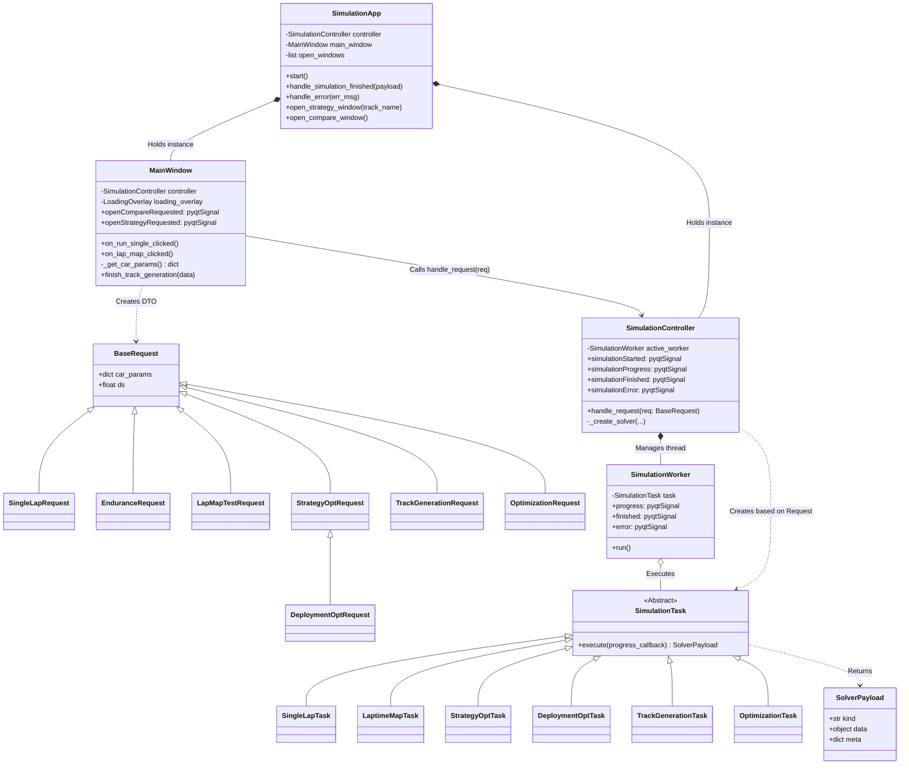
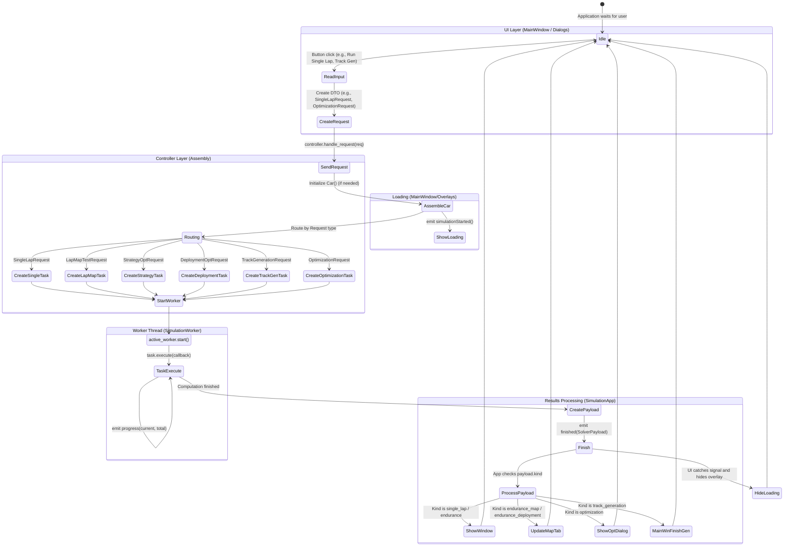

# architecture 

## 1. Class diagram

```mermaid
classDiagram
    class SimulationApp {
        -SimulationController controller
        -MainWindow main_window
        -list open_windows
        +start()
        +handle_simulation_finished(payload)
        +handle_error(err_msg)
        +open_strategy_window(track_name)
        +open_compare_window()
    }

    class MainWindow {
        -SimulationController controller
        -LoadingOverlay loading_overlay
        +openCompareRequested: pyqtSignal
        +openStrategyRequested: pyqtSignal
        +on_run_single_clicked()
        +on_lap_map_clicked()
        -_get_car_params() dict
        +finish_track_generation(data)
    }

    %% Data Transfer Objects (DTOs)
    class BaseRequest {
        +dict car_params
        +float ds
    }
    class SingleLapRequest
    class EnduranceRequest
    class LapMapTestRequest
    class StrategyOptRequest
    class DeploymentOptRequest
    class TrackGenerationRequest
    class OptimizationRequest
    
    BaseRequest <|-- SingleLapRequest
    BaseRequest <|-- EnduranceRequest
    BaseRequest <|-- LapMapTestRequest
    BaseRequest <|-- StrategyOptRequest
    BaseRequest <|-- TrackGenerationRequest
    BaseRequest <|-- OptimizationRequest
    StrategyOptRequest <|-- DeploymentOptRequest

    class SimulationController {
        -SimulationWorker active_worker
        +simulationStarted: pyqtSignal
        +simulationProgress: pyqtSignal
        +simulationFinished: pyqtSignal
        +simulationError: pyqtSignal
        +handle_request(req: BaseRequest)
        -_create_solver(...)
    }

    class SimulationWorker {
        -SimulationTask task
        +progress: pyqtSignal
        +finished: pyqtSignal
        +error: pyqtSignal
        +run()
    }

    %% Tasks
    class SimulationTask {
        <<Abstract>>
        +execute(progress_callback) SolverPayload
    }
    class SingleLapTask
    class LaptimeMapTask
    class StrategyOptTask
    class DeploymentOptTask
    class TrackGenerationTask
    class OptimizationTask
    
    SimulationTask <|-- SingleLapTask
    SimulationTask <|-- LaptimeMapTask
    SimulationTask <|-- StrategyOptTask
    SimulationTask <|-- DeploymentOptTask
    SimulationTask <|-- TrackGenerationTask
    SimulationTask <|-- OptimizationTask

    class SolverPayload {
        +str kind
        +object data
        +dict meta
    }

    %% Relationships
    SimulationApp *-- SimulationController : Holds instance
    SimulationApp *-- MainWindow : Holds instance
    
    MainWindow ..> BaseRequest : Creates DTO
    MainWindow --> SimulationController : Calls handle_request(req)
    
    SimulationController ..> SimulationTask : Creates based on Request
    SimulationController *-- SimulationWorker : Manages thread
    
    SimulationWorker o-- SimulationTask : Executes
    SimulationTask ..> SolverPayload : Returns
```

## 2. State diagram 

```mermaid
stateDiagram-v2
    [*] --> Idle: Application waits for user

    state "UI Layer (MainWindow / Dialogs)" as UI {
        Idle --> ReadInput: Button click (e.g., Run Single Lap, Track Gen)
        ReadInput --> CreateRequest: Create DTO (e.g., SingleLapRequest, OptimizationRequest)
        CreateRequest --> SendRequest: controller.handle_request(req)
    }

    state "Controller Layer (Assembly)" as Controller {
        SendRequest --> AssembleCar: Initialize Car() (if needed)
        AssembleCar --> Routing: Route by Request type
        Routing --> CreateSingleTask: SingleLapRequest
        Routing --> CreateLapMapTask: LapMapTestRequest
        Routing --> CreateStrategyTask: StrategyOptRequest
        Routing --> CreateDeploymentTask: DeploymentOptRequest
        Routing --> CreateTrackGenTask: TrackGenerationRequest
        Routing --> CreateOptimizationTask: OptimizationRequest
        
        CreateSingleTask --> StartWorker
        CreateLapMapTask --> StartWorker
        CreateStrategyTask --> StartWorker
        CreateDeploymentTask --> StartWorker
        CreateTrackGenTask --> StartWorker
        CreateOptimizationTask --> StartWorker
        
        StartWorker --> active_worker.start()
    }

    state "Loading (MainWindow/Overlays)" as Loading {
        AssembleCar --> ShowLoading: emit simulationStarted()
    }

    state "Worker Thread (SimulationWorker)" as Worker {
        active_worker.start() --> TaskExecute: task.execute(callback)
        TaskExecute --> TaskExecute: emit progress(current, total)
        TaskExecute --> CreatePayload: Computation finished
    }

    state "Results Processing (SimulationApp)" as Results {
        CreatePayload --> Finish: emit finished(SolverPayload)
        
        Finish --> ProcessPayload: App checks payload.kind
        ProcessPayload --> ShowWindow: Kind is single_lap / endurance
        ProcessPayload --> UpdateMapTab: Kind is endurance_map / endurance_deployment
        ProcessPayload --> ShowOptDialog: Kind is optimization
        ProcessPayload --> MainWinFinishGen: Kind is track_generation
    }

    ShowWindow --> Idle
    UpdateMapTab --> Idle
    ShowOptDialog --> Idle
    MainWinFinishGen --> Idle
    
    Finish --> HideLoading: UI catches signal and hides overlay
    HideLoading --> Idle
```