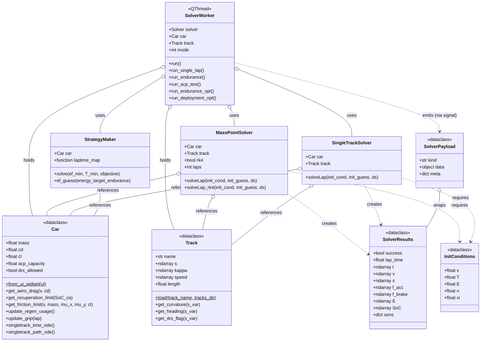
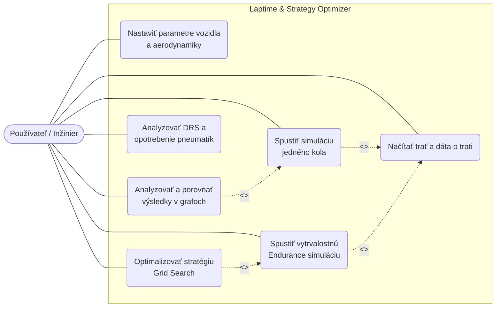
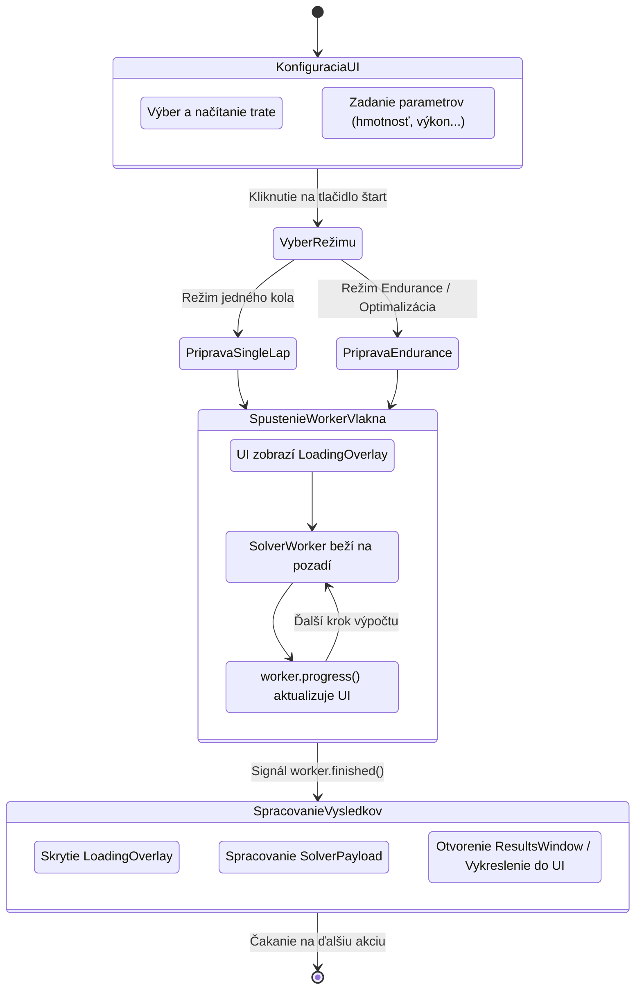

### 1. Class diagram

```mermaid
classDiagram
    %% --- DATA STRUCTURES ---
    class SolverResults {
        <<dataclass>>
        +bool success
        +float lap_time
        +ndarray t
        +ndarray v
        +ndarray s
        +ndarray f_acc
        +ndarray f_brake
        +ndarray E
        +ndarray SoC
        +dict sens
    }

    class InitConditions {
        <<dataclass>>
        +float v
        +float T
        +float E
        +float n
        +float xi
    }

    class SolverPayload {
        <<dataclass>>
        +str kind
        +object data
        +dict meta
    }

    %% --- CORE ---
    class Car {
        <<dataclass>>
        +float mass
        +float cd
        +float cl
        +float acp_capacity
        +bool drs_allowed
        +from_ui_widget(ui)$
        +get_aero_drag(v, cd)
        +get_recuperation_limit(SoC_ca)
        +get_friction_limit(v, mass, mu_x, mu_y, cl)
        +update_regen_usage()
        +update_grip(lap)
        +singletrack_time_ode()
        +singletrack_path_ode()
    }

    class Track {
        <<dataclass>>
        +str name
        +ndarray s
        +ndarray kappa
        +ndarray speed
        +float length
        +load(track_name, tracks_dir)$
        +get_curvature(s_var)
        +get_heading(s_var)
        +get_drs_flag(s_var)
    }

    %% --- SOLVERS ---
    class MassPointSolver {
        +Car car
        +Track track
        +bool rk4
        +int laps
        +solveLap(init_cond, init_guess, ds)
        +solveLap_rk4(init_cond, init_guess, ds)
    }

    class SingleTrackSolver {
        +Car car
        +Track track
        +solveLap(init_cond, init_guess, ds)
    }

    class StrategyMaker {
        +Car car
        +function laptime_map
        +solve(ef_min, T_min, objective)
        +ef_guess(energy_target_endurance)
    }

    %% --- WORKERS ---
    class SolverWorker {
        <<QThread>>
        +Solver solver
        +Car car
        +Track track
        +int mode
        +run()
        +run_single_lap()
        +run_endurance()
        +run_acp_test()
        +run_endurance_opt()
        +run_deployment_opt()
    }

    %% --- RELATIONSHIPS ---
    %% Aggregations & Compositions
    SolverWorker o-- Car : holds
    SolverWorker o-- Track : holds
    SolverWorker o-- MassPointSolver : uses
    SolverWorker o-- SingleTrackSolver : uses
    SolverWorker o-- StrategyMaker : uses
    
    MassPointSolver o-- Car : references
    MassPointSolver o-- Track : references
    SingleTrackSolver o-- Car : references
    SingleTrackSolver o-- Track : references
    StrategyMaker o-- Car : references

    %% Dependencies (Creates/Uses)
    MassPointSolver ..> SolverResults : creates
    MassPointSolver ..> InitConditions : requires
    SingleTrackSolver ..> SolverResults : creates
    SingleTrackSolver ..> InitConditions : requires
    
    SolverWorker ..> SolverPayload : emits (via signal)
    SolverPayload o-- SolverResults : wraps
```

### 2. Use case diagram

```mermaid
flowchart LR
    %% Aktéri
    User([Používateľ / Inžinier])

    %% Hranice systému (Aplikácia)
    subgraph App [Laptime & Strategy Optimizer]
        UC1(Načítať trať a dáta o trati)
        UC2(Nastaviť parametre vozidla\n a aerodynamiky)
        UC3(Spustiť simuláciu\n jedného kola)
        UC4(Spustiť vytrvalostnú\n Endurance simuláciu)
        UC5(Optimalizovať stratégiu\n Grid Search)
        UC6(Analyzovať a porovnať\n výsledky v grafoch)
        UC7(Analyzovať DRS a\n opotrebenie pneumatík)
    end

    %% Prepojenia (Kto čo robí)
    User --- UC1
    User --- UC2
    User --- UC3
    User --- UC4
    User --- UC5
    User --- UC6
    User --- UC7

    %% Vzťahy medzi prípadmi použitia
    UC3 -.->|<<includes>>| UC1
    UC4 -.->|<<includes>>| UC1
    UC5 -.->|<<extends>>| UC4
    UC6 -.->|<<includes>>| UC3
```

### 3. Activity diagram

```mermaid
stateDiagram-v2
    [*] --> KonfiguraciaUI

    state KonfiguraciaUI {
        VyberTrate: Výber a načítanie trate
        ParametreVozidla: Zadanie parametrov (hmotnosť, výkon...)
    }

    KonfiguraciaUI --> VyberRežimu: Kliknutie na tlačidlo štart
    
    state VyberRežimu <<choice>>
    VyberRežimu --> PripravaSingleLap : Režim jedného kola
    VyberRežimu --> PripravaEndurance : Režim Endurance / Optimalizácia

    PripravaSingleLap --> SpustenieWorkerVlakna
    PripravaEndurance --> SpustenieWorkerVlakna

    state SpustenieWorkerVlakna {
        ZobrazenieLoading: UI zobrazí LoadingOverlay
        VypocetWorker: SolverWorker beží na pozadí
        AktualizaciaProgresu: worker.progress() aktualizuje UI
        
        ZobrazenieLoading --> VypocetWorker
        VypocetWorker --> AktualizaciaProgresu
        AktualizaciaProgresu --> VypocetWorker: Ďalší krok výpočtu
    }

    SpustenieWorkerVlakna --> SpracovanieVysledkov: Signál worker.finished()

    state SpracovanieVysledkov {
        ZatvorenieLoading: Skrytie LoadingOverlay
        RozbaleniePayload: Spracovanie SolverPayload
        VykreslenieGrafov: Otvorenie ResultsWindow / Vykreslenie do UI
    }

    SpracovanieVysledkov --> [*]: Čakanie na ďalšiu akciu
```